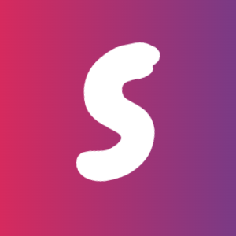

<!-- markdownlint-disable-next-line -->
<p align="center">
  
  <h1 align="center">Next 3D</h1>
</p>
</br>
<p align="center">
  The 3D tools helps you create the best web 3D app.
</p>
<div align="center">

[](https://github.com/mui-org/material-ui/blob/HEAD/LICENSE)
[](https://www.npmjs.com/package/@mui/material)
[](https://www.npmjs.com/package/@mui/material)
[](https://www.npmjs.com/package/@mui/material)
[](https://codecov.io/gh/mui-org/material-ui/branch/master)
[](https://github.com/mui-org/material-ui/issues/27062)
[](https://isitmaintained.com/project/mui-org/material-ui 'Average time to resolve an issue')

English | [Português](./README-pt_BR.md) | [简体中文](./README-zh_CN.md) | [Українською](./README-uk_UA.md) | [Spanish](./README-sp_MX.md) | [日本語](./README-ja_JP.md)

  
</div>

## ✨ Features

- 🌈 Cutting-edge and fashionable ui design.
- 📦 A set of high-quality React components out of the box.
- 🛡 Written in TypeScript with predictable static types.
- ⚙️ Whole package of design resources and development tools.
- 📖 Extensive documentation and demos
- 🌍 Support i18n, built-in N+ languages
- 🎨 Powerful theme customization in every detail.

## 🖥 Environment Support

- Modern browsers
- Server-side Rendering
- [Electron](https://www.electronjs.org/)

| [](http://godban.github.io/browsers-support-badges/)<br>Edge | [](http://godban.github.io/browsers-support-badges/)<br>Firefox | [](http://godban.github.io/browsers-support-badges/)<br>Chrome | [](http://godban.github.io/browsers-support-badges/)<br>Safari | [](http://godban.github.io/browsers-support-badges/)<br>Electron |
| ---------------------------------------------------------------------------------------------------------------------------------------------------------------------------------------------------- | ---------------------------------------------------------------------------------------------------------------------------------------------------------------------------------------------------------------- | ------------------------------------------------------------------------------------------------------------------------------------------------------------------------------------------------------------ | ------------------------------------------------------------------------------------------------------------------------------------------------------------------------------------------------------------ | -------------------------------------------------------------------------------------------------------------------------------------------------------------------------------------------------------------------- |
| Edge                                                                                                                                                                                                 | last 2 versions                                                                                                                                                                                                  | last 2 versions                                                                                                                                                                                              | last 2 versions                                                                                                                                                                                              | last 2 versions                                                                                                                                                                                                      |

## ⭐ Support the project

If you feel awesome and want to support us in a small way, please consider starring and sharing the repo! This helps us getting known and grow the community. 🙏


## 🔨 Documentation

Visit [https://s3d.org/docs](https://s3d.org/docs) to view the full documentation.

## 📦 Quick Start

1. Installation: Inside your React project directory, install Next3D by running either of the following:

```bash
yarn add @next3d/core @emotion/react
# or
npm i @next3d/core @emotion/react
```

2. Here is a quick react example to get you started, **it's all you need**:

```jsx
import { createBox, createSphere, vec3, createEngine, createScene, createPerspectiveCamera, createPointLight } from "../lib";
import { createGround } from "../lib/meshes";
import { scale, translate } from "../lib/transform";
import React,{ useEffect } from 'react';
import ReactDOM from 'react-dom';
import { Button } from 'rana-ui';

function App() {
  useEffect(() => {
    (async () => {
      const canvas = document.getElementById(
        "webgpu-canvas"
      ) as HTMLCanvasElement;

      if (!canvas) {
        console.error("canvas is not exist.");
      }

      const engine = createEngine(canvas);
      const scene = createScene(engine);

      const camera = createPerspectiveCamera(
        "c1",
        { target: vec3(0, 0, 1), position: vec3(0, 0, -1), up: vec3(0, 1, 0) },
        scene
      );


      const box = createBox("b", scene, {
        width: 2, height: 2, depth: 2
      });


      const light = createPointLight(
        "light1",
        { color: vec3(0, 0.4, 0), position: vec3(-1, -1, -1), intensity: 10, radius: 10 },
        scene
      );

      await engine.loop(() => {
        box.transform = translate(-0.02, 0, 0).mul(box.transform)
        scene.render();
      });
    })();
  }, []);

  return <canvas
          id="webgpu-canvas"
          width="512"
          height="512
        ."
        ></canvas>;
}

ReactDOM.render(<App />, document.querySelector('#app'));
```

## 🤝 Contribution

Please make sure to read the [Contributing Guide](https://github.com/fogcity/ui/blob/main/contributing.md) before making a pull request and commit with [Commit Guide](https://github.com/fogcity/ui/blob/main/commit-convention.md).

## ❤️ Sponsors

Thank you to all the people who already contributed to us!

## 🔗 License

[MIT](https://opensource.org/licenses/MIT)
